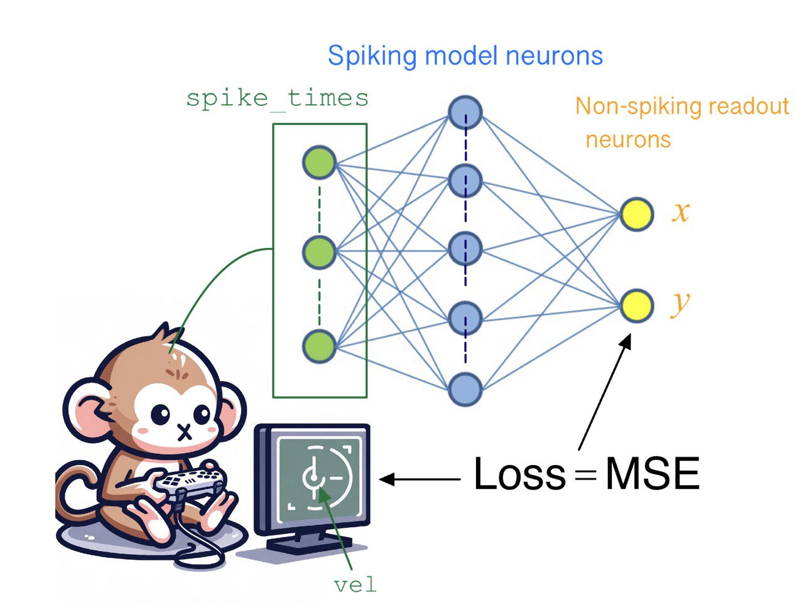

# Spiking Neural Networks (SNNs) project

In the context of this project, a dataset of neural spike trains are recorded from a monkey's motor cortext while it was doing a task involving moving a pointer on a screen.

> _The original data was recorded for the paper ["Population coding of conditional probability distributions in dorsal premotor cortex" (Glaser et al. 2018)](https://www.nature.com/articles/s41467-018-04062-6)._

    

In this project, an SNN (more specifically, a network of Leaky Integrate-and-Fire (LIF) neurons) is used to decode the recorded velocity of the pointer from the neural data. 
The SNN models in this project were trained using surrogate gradient descent and follows the general approach of the article ["Machine learning for neural decoding" (Glaser et al. 2020)](https://www.eneuro.org/content/7/4/ENEURO.0506-19.2020), but using an SNN instead of the statistical and artificial NN models used in the paper. 
_The GitHub repository for the original paper can be found [here](https://github.com/KordingLab/Neural_Decoding)._

The project extends the results of the paper further by implementing Longer Length Decoding, as well as analysing the results of comparing a non-spiking model to 3 different spiking network models, considering the impact of training and computational resources on accuracy (MSE).

&nbsp;
&nbsp;

_This project was completed by Bastien Baluyot and Abdel-Qader Al-Kilany as a coursework assignment for the ["Neuroscience for Machine Learners"](https://neuro4ml.github.io/) module at Imperial College London._
